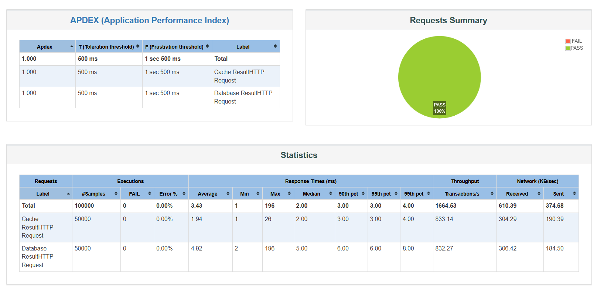

# Spring Boot Caching Performance Benchmark

This project is an experiment to measure how Redis caching will improve response time and throughput
compared to direct database queries using MongoDB.

## Objective

The main goal of this project is to demonstrate the performance difference between:

- A product search API using Redis as a caching layer
- A traditional product search API querying to MongoDB directly

The result helps answer:
**"Is caching really worth it for backend performance?"**
---

## Benchmark Result

> Run using 5000 threads, 10 loops, 60s ramp-up



Redis-cached requests clearly show lower average response time and higher throughput compared to
MongoDB-only request.

---

## Try It Yourself

Follow these steps to run the experiment locally.

### 1. Clone the Repository

```
git clone https://github.com/arycenas/caching-experiment.git
cd caching-experiment
```

### 2. Start MongoDB & Redis with Docker

```
docker run -d --name mongo -p 27017:27017 mongo:latest
docker run -d --name redis -p 6379:6379 redis
```

### 3. Generate Sample Products

```http request
POST /product/generate?count=10000
```

> `count` is flexible — use any number based on your testing need.

### 4. Load Test with JMeter

Use Apache JMeter to simulate high-concurrency access.
> You can modify the Thread Group (threads, loop count, ramp-up time) to suit your system
> capabilities.